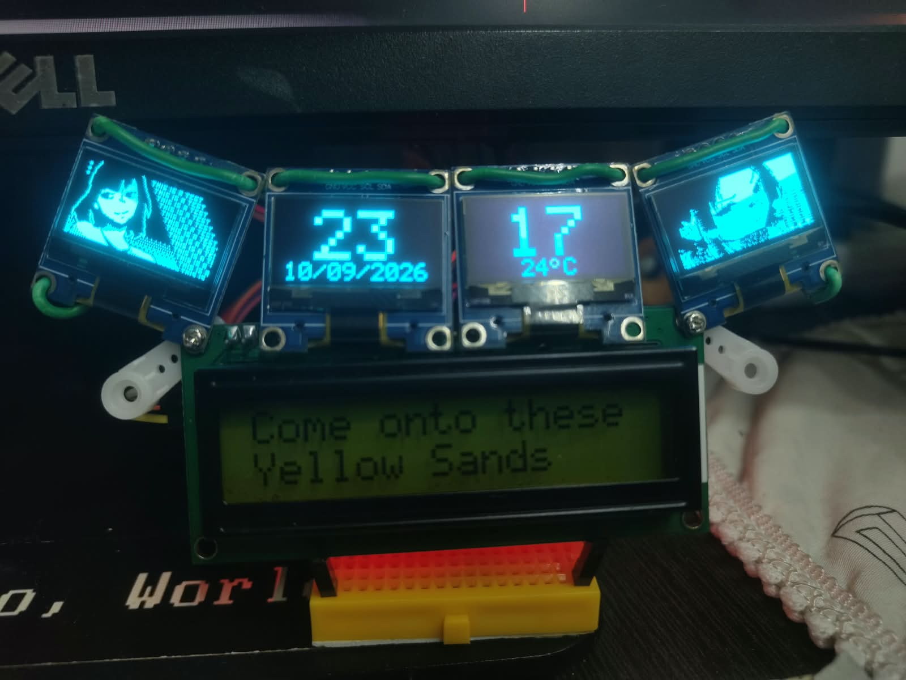
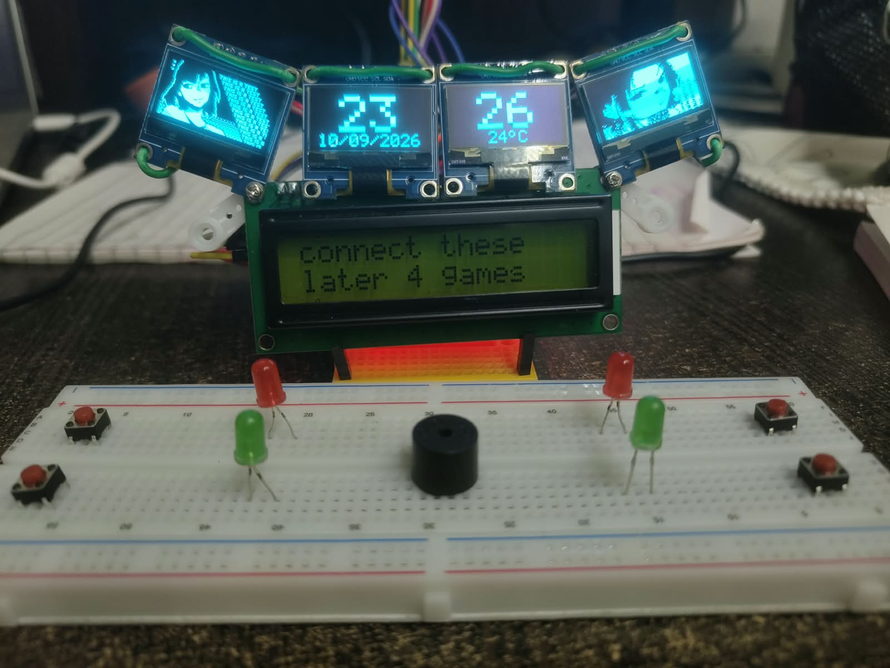
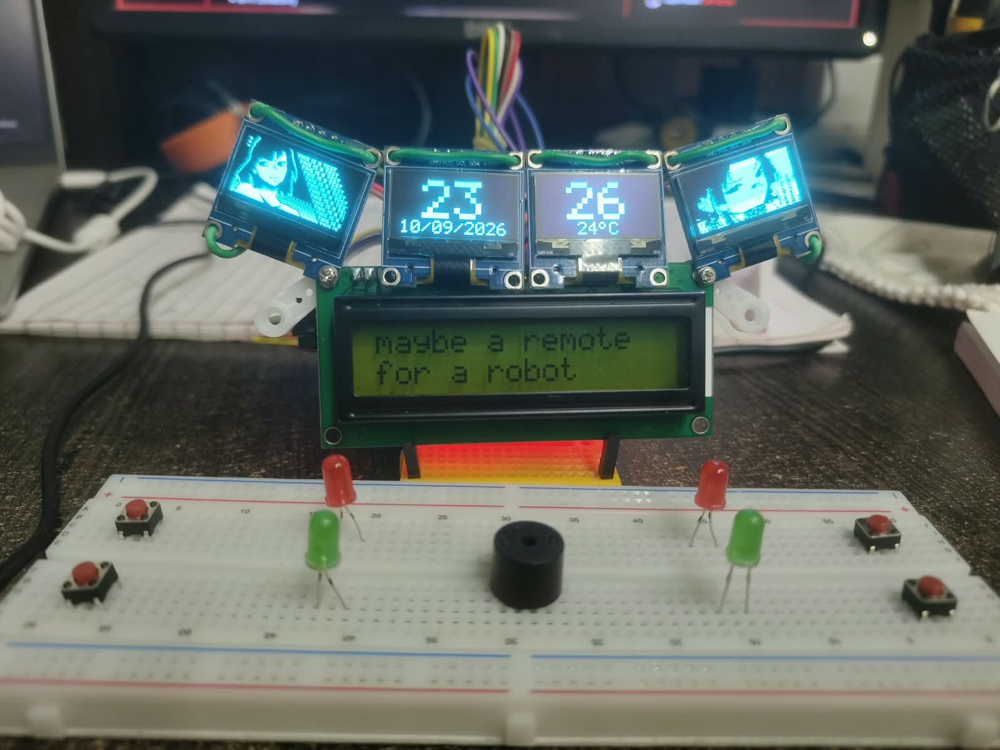
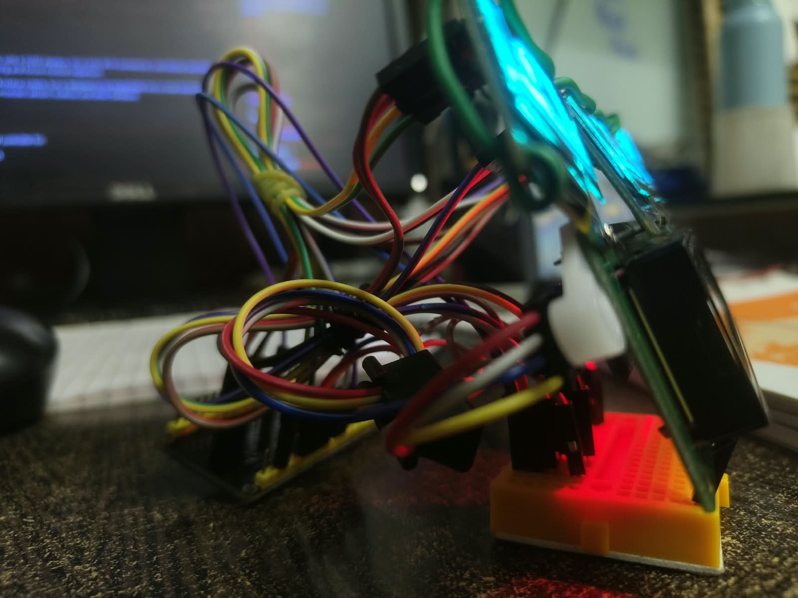
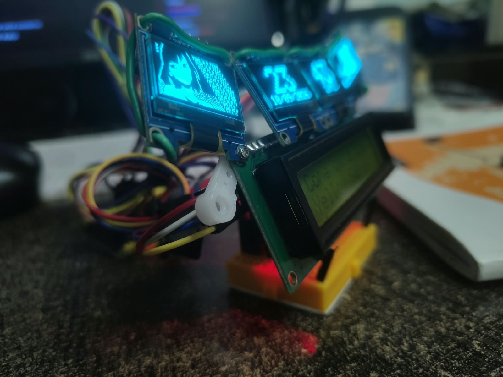
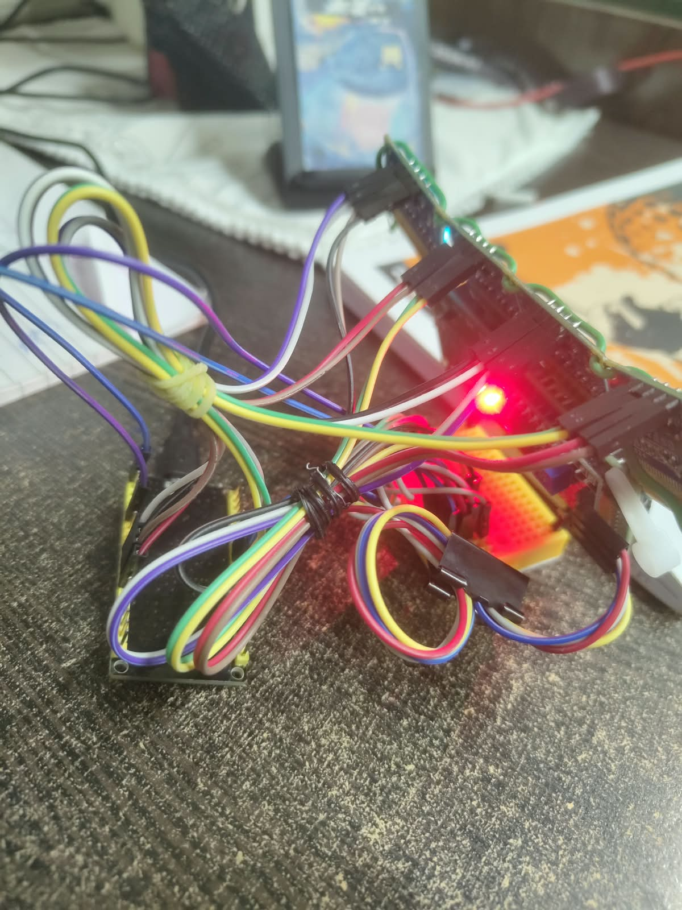
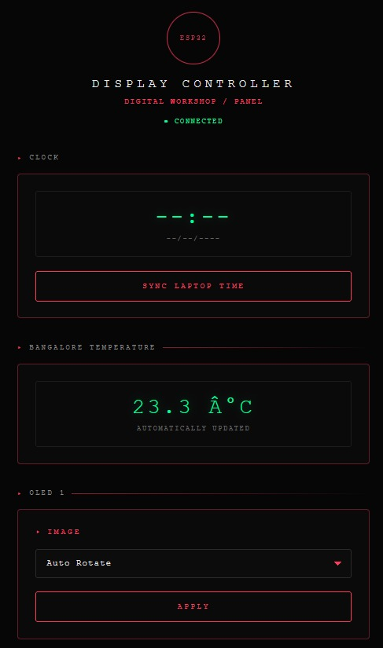
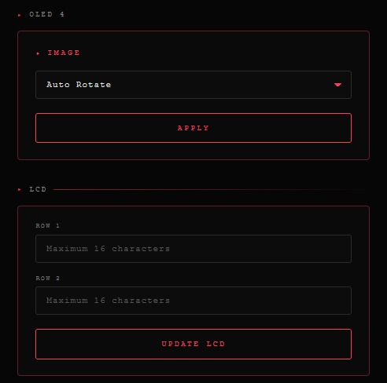

# StatClock
An IoT-based ESP32 clock/status system with 4 OLED displays, 16×2 LCD, Wi-Fi connectivity, and remote web-based control, designed for real-time monitoring and future modular expansion.

The project started as a dedicated clock/status system, but is designed to be expandable into a small standalone ESP32 computer with additional input modules, sensors, buttons, and other hardware.

  

---

## Overview

StatClock uses an ESP32 as the central controller for:

- 4 SSD1306 128×64 OLED displays
- A 16×2 I2C LCD
- Wi-Fi connectivity
- Browser-based control interface
- Clock, date and temperature display
- Rotating bitmap images
- Remotely editable LCD text

The goal is to keep the system expandable so that additional hardware and functionality can be added without redesigning the entire project.

The OLEDs use manually implemented software I2C connections, while the LCD uses the ESP32 hardware I2C interface.

### OLED 1

| Connection | ESP32 |
|---|---:|
| SDA | GPIO 21 |
| SCL | GPIO 22 |

### OLED 2

| Connection | ESP32 |
|---|---:|
| SDA | GPIO 25 |
| SCL | GPIO 26 |

### OLED 3

| Connection | ESP32 |
|---|---:|
| SDA | GPIO 32 |
| SCL | GPIO 33 |

### OLED 4

| Connection | ESP32 |
|---|---:|
| SDA | GPIO 16 |
| SCL | GPIO 17 |

### LCD

| Connection | ESP32 |
|---|---:|
| SDA | GPIO 18 |
| SCL | GPIO 19 |
| I2C Address | 0x27 |

OLED address:

    0x3C

---

## Hardware Photos

  

  

  

  

# Software

The firmware is written in:

- C++
- Arduino framework
- ESP32 Arduino core

---

Main functionality includes:

- Custom software I2C implementation
- SSD1306 initialization
- Direct SSD1306 commands
- Bitmap rendering
- Image rotation
- Wi-Fi connection
- HTTP web server
- Remote LCD control
- Remote OLED image selection
- Time synchronization
- Local time keeping between synchronizations

---

## Epic wire Management:

  

# Image System

Images are stored directly inside the ESP32 firmware as monochrome 128×64 bitmap arrays.

The ESP32 does not need to download the images from the computer.

The browser interface only tells the ESP32 which already-stored image to display.

# Web Interface

StatClock contains a web interface hosted by the ESP32.

When the ESP32 is connected to Wi-Fi, the interface can be accessed using the ESP32's local IP address.
The interface is designed to be linear so it looks good on both desktop and mobile.

  

  

